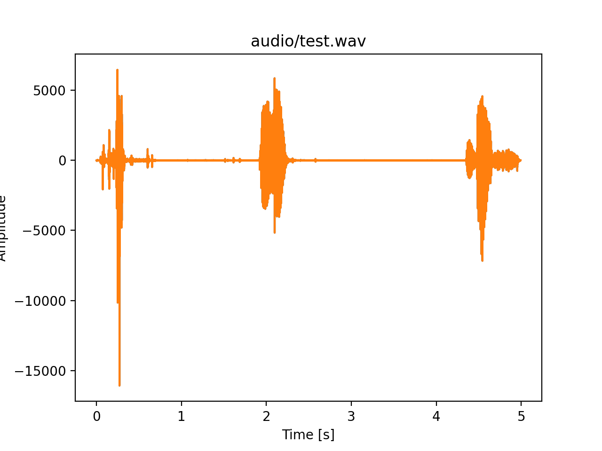
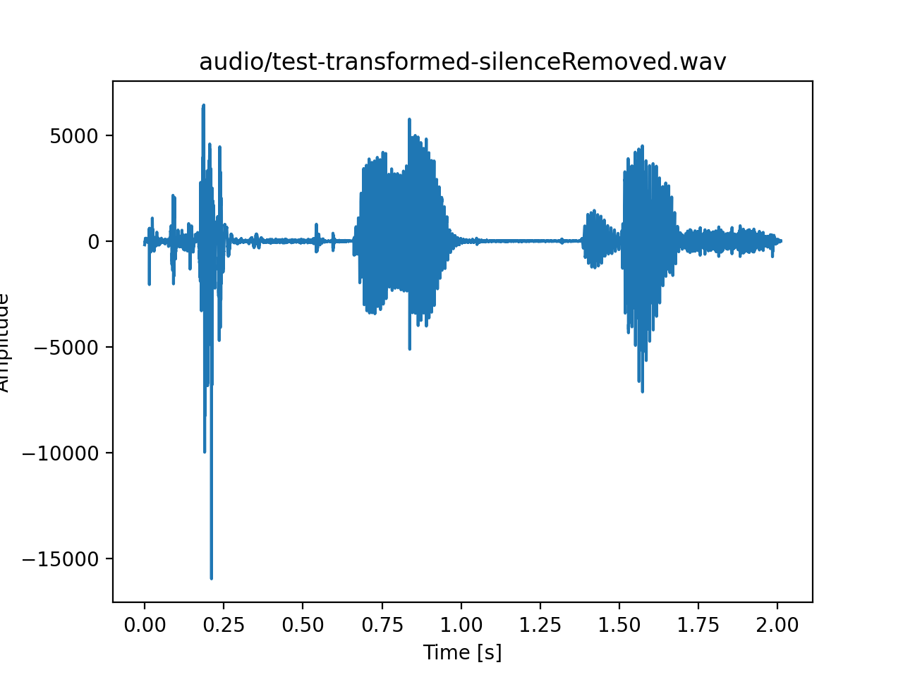

# realtime-vad
testing vad on realtime

python3 -V
Python 3.9.1

python3 -m pip install --user pipenv
sudo -H pip install -U pipenv

brew install portaudio

# Steps to process audio
All files will be stored on audio folder with the filename as a wav file

```sh
pipenv shell
pipenv install 
python audioCapture.py <fileName>
python playback.py <pathToFile>
python plotAudio.py <pathToFile>
python transform.py <pathToFile>
python silenceremove.py <aggressiveness> <fileName>
python plotAudio.py <pathToNewFileWithSilenceRemoved>
```

# PoC

Audio before silence removal:



Duration of Audio in Seconds 4.992290249433107
Duration of Audio in Minutes 0.08320483749055178

Audio after silence removal:



Duration of Audio in Seconds 2.01
Duration of Audio in Minutes 0.033499999999999995

# Plot real time audio
python plotInput.py

# Docs

https://ngbala6.medium.com/audio-processing-and-remove-silence-using-python-a7fe1552007a